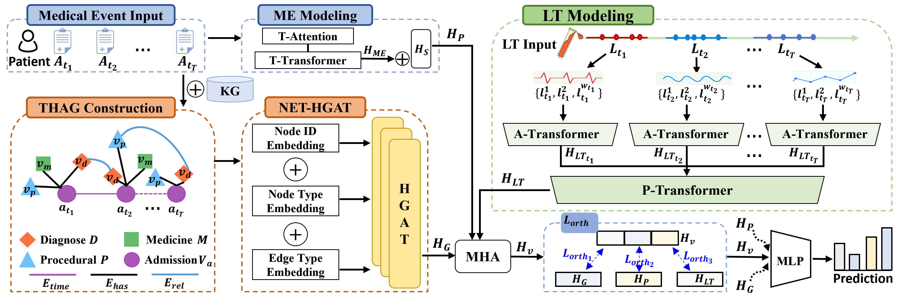

**This repository is the implementation of the paper: "Knowledge-Enhanced Complementary Information Fusion with Temporal Heterogeneous Graph Learning for Disease Prediction"**

## Highlights
Disease prediction based on multimodal data is a critical yet challenging task in healthcare, especially in intensive care units (ICUs) where patients present complex clinical trajectories with multiple admissions and comorbidities. Current multimodal learning approaches lack effective modeling of cross-modal complementary information, which leads to suboptimal feature interactions. Besides, traditional methods that incorporate external knowledge graphs (KGs) often introduce noise and computational complexity, due to the use of all one-hop neighbors within the KGs. To address these challenges, we propose Knowledge-Enhanced Complementary Information Fusion with temporal heterogeneous graph learning (KCIF) for patient modeling. KCIF introduces a temporal heterogeneous admission graph (THAG) that integrates KGs to capture semantic and temporal dependencies across admissions. It further employs a complementary information fusion mechanism to leverage mutual enhancement between lab tests and medical events. 



## The main directory structure is as follows:

```
KCIF/
├── train.py              # Main program entry
├── metrics.py  # evaluate function
├── modeling/                   # Core model definitions
│   ├── modeling_qagnn.py      
│   ├── modeling_kcif.py       
│   ├── PatientEncoding.py     
│   ├── modeling_seqG.py       
│   └──......
├── data/                      # Data storage directory
│   ├── mimiciii/                         
│   └── mimiciv/              
├── utils/                     # Utility functions
│   ├── data_hita.py          
│   ├── parser_utils.py       
│   ├── obtain_lab_data.py  
│   └── ......  
```

## Usage

All hyperparameters and model configurations are centrally managed in `qagnn_hita.py`. To start model training and validation, simply run:

```bash
python qagnn_hita.py
```

All configuration parameters can be easily adjusted to meet your specific experimental requirements.

## Acknowledgments
This project is built on the following open source projects, we would like to thank in particular:

1. **CHET**: https://github.com/luchang-cs/chet
2. **KGxDP**: https://github.com/SCUT-CCNL/KGxDP  
3. **HiTANet**: https://github.com/HiTANet2020/HiTANet
